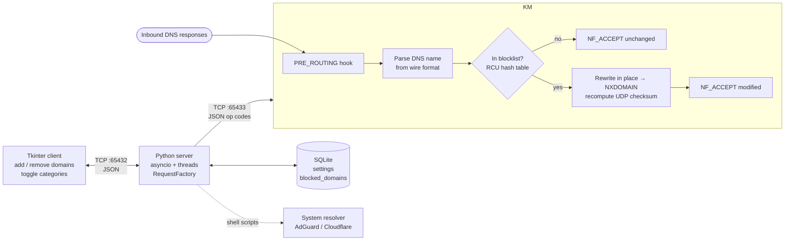

# My_Internet

A household network filter that blocks domains from inside the Linux kernel. A netfilter module written in C inspects DNS traffic on the way in, rewrites responses for blocked names into `NXDOMAIN`, and takes its blocklist over a socket from a Python service with a desktop GUI.

Three processes, three languages, one blocklist: a kernel module in C, a management server in Python on SQLite, and a Tkinter client.

---

## How it works



The module registers one hook at `NF_INET_PRE_ROUTING` with priority `NF_IP_PRI_FIRST`. Every inbound IPv4 packet is cheaply rejected unless it is UDP with source port 53; for the survivors, the queried name is parsed out of the DNS question section and looked up in an in-kernel hash table. A miss costs a hash and a string compare. A hit is rewritten in place and accepted.

---

## Design decisions

### Filter the name, not the address

The obvious kernel filter drops packets by destination IP. That fails in practice: addresses behind a CDN are shared between the site you want to block and a hundred you do not, and they change without warning. Filtering the *name resolution* kills the connection before it is opened, regardless of which IP the domain currently points at, and one blocklist entry covers every address the domain ever resolves to.

**What this is not.** This is a household content filter, not a security boundary. Anything that resolves names another way — DNS-over-HTTPS, DNS-over-TLS, a hardcoded resolver, a VPN, or a plain `/etc/hosts` entry — walks straight past it. Enforcing against a motivated adversary means blocking egress at the gateway and pinning the resolver, which is a different project. Stating the threat model is part of the design.

### Rewrite into NXDOMAIN rather than drop

Dropping the response leaves the client waiting. The resolver retries, the stub resolver retries, and the browser hangs for seconds before it finally gives up with a timeout — slow and indistinguishable from a broken network.

Rewriting the packet into a well-formed `NXDOMAIN` answers the question immediately: the domain does not exist, fail now. The rewrite is done in place on the existing `sk_buff` — set the response bit and the `NXDOMAIN` rcode, zero the answer, authority and additional counts, then recompute the UDP checksum over the modified payload:

```c
dns->flags |= htons(DNS_RESPONSE | DNS_NXDOMAIN);
dns->ans_count = dns->auth_count = dns->add_count = 0;

udp->check = 0;
skb->csum = csum_partial((unsigned char *)udp, ntohs(udp->len), 0);
udp->check = csum_tcpudp_magic(ip_hdr(skb)->saddr, ip_hdr(skb)->daddr,
                               ntohs(udp->len), IPPROTO_UDP, skb->csum);
```

Editing in place avoids allocating and forging a fresh packet, but it is unforgiving: forget the checksum and the client silently discards a packet that looks correct in a hex dump. The hook returns `NF_ACCEPT` either way — modified or not, the packet continues up the stack.

### RCU for the blocklist, because the read path is a hot path

The lookup runs in softirq context for every inbound DNS response, while writes happen when a human types a domain into a GUI — reads outnumber writes by orders of magnitude, and the reader cannot afford to sleep or contend.

That is the case RCU exists for. Readers take `rcu_read_lock()`, which costs essentially nothing and never blocks. Writers serialise against each other on a spinlock, and a removal unlinks the entry, waits out the grace period, and only then frees:

```c
spin_lock(&__cache_lock);
hash_del_rcu(&entry->node);          /* unlink first */
spin_unlock(&__cache_lock);

synchronize_rcu();                   /* wait for in-flight readers */
kfree(found_entry->domain);
kfree(found_entry);
```

Freeing before `synchronize_rcu()` would let a reader in the hook dereference memory that has already gone back to the allocator — a use-after-free in softirq context, which is the kind of bug that panics a machine under load and not on a test box. The store itself is a 256-bucket kernel hash table (`DEFINE_HASHTABLE` with 8 bits) keyed on a simple multiplicative string hash.

### Parsing DNS names by hand, defensively

Wire-format names are length-prefixed labels — `[3]www[7]example[3]com[0]` — not C strings, and the parser has to handle message compression, where a label beginning `0xC0` is a back-pointer into the packet rather than data. Every step checks the remaining space in the destination buffer before copying, and bails out rather than truncating blindly:

```c
step = *src++;
if (step >= max_len - len - 1)
    return -1;
if (step == 0 || (step & 0xC0) == 0xC0)
    break;
```

This is attacker-influenced input being parsed in kernel space with a fixed 256-byte buffer, so bounds come before features. Compression pointers terminate parsing rather than being followed — following them requires validating that the offset points backwards and inside the packet, and an unvalidated pointer loop is a classic way to hang a kernel thread. Stopping early loses a rare corner case and cannot be made to spin.

### A hand-written JSON parser in the kernel, and why that is the risky part

The kernel has no libc and no JSON library, and pulling one in is not an option. `json_parser.c` is therefore a deliberately minimal key-scanner over a NUL-terminated buffer: find `"key"`, look at the first byte of the value, read to the closing `"` or `]`. It understands strings and flat arrays and nothing else, with a length cap on the key.

**This is the weakest surface in the design** and worth naming: it is bespoke parser code running in ring 0. Two things contain it — the socket only accepts loopback traffic from the local management server, and the parser never allocates based on a length taken from the input. A hardened version would move the parsing to userspace and pass the kernel a fixed binary struct, leaving nothing to parse in the kernel at all.

### A loopback TCP socket for the control plane — a compromise, not the ideal

The module opens a kernel socket to `127.0.0.1:65433` and runs a `kthread` blocking in `kernel_recvmsg`, handling small JSON messages with numeric operation codes — `52` add domain, `53` remove domain, `55` initial settings, shared with the Python side so both ends read from one table of constants.

The reason is reuse: the GUI already speaks JSON over TCP to the server, so the kernel speaks the same dialect and one message format covers both links.

**The idiomatic choice is netlink**, which is designed for exactly this, carries sender credentials, and does not require the kernel to own a TCP socket and a thread. The cost of the shortcut is concrete: any local process can connect to port 65433 and push a blocklist update, because a TCP port has no owner. A real deployment needs netlink or a unix socket with filesystem permissions.

### Unwinding init in reverse

Module init brings up the cache, the netfilter hooks and the network thread in order, and each failure jumps to a label that tears down exactly what came before:

```c
fail_network:   cleanup_netfilter();
fail_netfilter: cleanup_cache();
fail:           return ret;
```

A half-initialised module that returns an error but leaves a hook registered is a kernel panic waiting for the next packet. The `goto` ladder is the standard kernel idiom for this, and it is the reason the module can fail to load without taking the machine with it.

### Categories delegated to an upstream resolver

Per-domain blocking is what the kernel module does well. Blocking *ads* or *adult content* means a list of millions of names that changes daily — maintaining that in-kernel would be all of the work and none of the interest.

So the category toggles do something different: the server shells out to scripts that repoint the system resolver at a filtering upstream (AdGuard, AdGuard Family, or Cloudflare's `1.1.1.3`), and `reset_dns.sh` puts it back. The division is deliberate — the kernel enforces the user's explicit list, the upstream resolver handles the categories, and neither reimplements the other.

### Async for one connection, threads for the other

The server holds two listeners with different shapes. The kernel link is a single long-lived connection that mostly idles, which is a natural fit for `asyncio` — it keeps the `StreamWriter` and pushes updates as they happen. The GUI link is short, blocking request/response exchanges, handled on a thread.

Mixing both in one process is not elegant, and unifying them is the obvious cleanup. It is written down here rather than hidden because the shapes really are different, and a single event loop would have meant restructuring working GUI code for no user-visible gain.

---

## Layout

| Path | Contents |
|---|---|
| `kernel/src/netfilter.c` | The hook, DNS parsing, the NXDOMAIN rewrite |
| `kernel/src/cache.c` | RCU hash table of blocked domains |
| `kernel/src/network.c` | Kernel socket + `kthread`, op-code dispatch |
| `kernel/src/json_parser.c` | Minimal in-kernel JSON key scanner |
| `kernel/src/utils.h` | Shared constants — ports, op codes, DNS header struct |
| `server/src/server.py` | asyncio kernel link + threaded client link |
| `server/src/handlers.py` | `RequestFactory` and one handler per operation |
| `server/src/db_manager.py` | SQLite — `settings`, `blocked_domains` |
| `server/src/dns_manager.py` | Resolver switching via the scripts |
| `client/src/` | Tkinter GUI, config, socket communicator |
| `scripts/` | install, activate, deactivate, resolver switching |

Message codes are defined once per side — `kernel/src/utils.h` and `server/src/utils.py` — and kept in step by hand; a shared generated header would be the better answer if the protocol grew.

---

## Running it

Linux only, needs kernel headers, GCC, Make and root for module operations.

```bash
sudo ./scripts/install.sh      # build the module, install Python deps
sudo ./scripts/activate.sh     # insert the module, start server and GUI
sudo ./scripts/deactivate.sh   # remove the module, stop the service
```

Working on the module directly:

```bash
cd kernel
make            # build Network_Filter.ko
make install    # insmod
make read       # dmesg, filtered to this module
make remove     # rmmod
```

Blocks, cache updates and `NXDOMAIN` responses are logged through `printk`, so `make read` is the first place to look when a domain is not being blocked.

## Tests

```bash
pytest server/tests    # handlers, server
pytest client/tests    # application, communicator, view
```

The Python halves are covered. The kernel module is not — testing it means a VM and a packet generator, and that harness does not exist here.

---

## Known limitations

- **DoH and DoT bypass it entirely.** See the threat model above.
- **IPv4 and UDP only.** The hook checks `IPPROTO_UDP` and an IPv4 header; DNS over TCP and any AAAA path over IPv6 are untouched.
- **The control socket is unauthenticated** and reachable by any local process.
- **Compression pointers end parsing** rather than being followed.
- **No kernel-side tests.**
- **The two constant tables are duplicated** across C and Python.

---

## Stack

C (Linux kernel: netfilter, RCU, hash tables, kthreads, kernel sockets) · Python (asyncio, sockets, SQLite, pytest) · Tkinter · Bash
